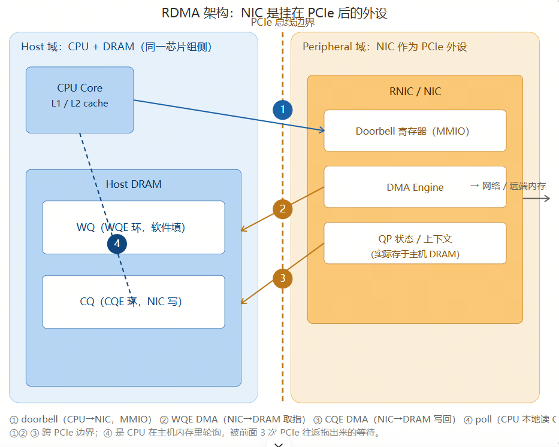

# RDMA实现原理

# RDMA 背景

## 传统网络的痛点

在**经典 TCP/IP 网络栈**中，一次数据收发需要 CPU 大量介入：

- **发送：**数据从**用户态**拷贝到**内核态**（系统调用）→ 经过 TCP/IP 协议栈逐层封装（计算校验和、分段）→ 再从内核拷贝到网卡缓冲区（DMA）。

- **接收：**完全反向，网卡 DMA 到内核 → 协议栈处理 → 拷贝到用户态。

由此带来三大问题：**多次内存拷贝**（CPU 开销大）、**频繁上下文切换**（用户态↔内核态）、**协议栈占用 CPU**。结果就是延迟高（通常为几十到几百微秒），且高带宽下 CPU 容易成为瓶颈。

### 传统网络数据搬移流程

1. 数据搬移图例（地址视角）

四个水平带代表数据在发送过程中依次驻留的**不同内存地址空间**；带与带之间的箭头表示一次**地址搬移**，并标注搬移方式与执行者。

应用数据 \(payload\)协议头部 \(header\)用户态内存内核态内存物理 / DMA 内存网卡硬件

**原地前置协议头**，payload 字节不再复制 \[Eth\]\[IP\]\[TCP\] 头部 payload（同前） VA\_k = 0xffff8880\_1a2b ③④⑤ 封装：保留 headroom → 前置 TCP/IP/Eth 头；若超 MSS 则分片\(复制\)；校验和/分片处理 ⑥ DMA 映射 \(dma\_map\_single\) VA\_k → 总线物理地址 PA（地址翻译，不搬数据） \* 无 SG 时还需"线性化拷贝"→ 又一次 CPU 拷贝 ⑦ 物理内存 / DMA 地址 \(PA，网卡可见\) 同一份数据，经 IOMMU/MMU 映射为总线物理地址，供网卡 DMA 读取 数据块 \(DMA\-able\) PA = 0x0000\_1a2b\_0000 ⑧ NIC DMA 引擎读取 硬件搬移：物理 RAM\(PA\) → 网卡内部（CPU 不参与） ⑨ 网卡内部 TX FIFO / 缓冲（硬件地址空间） 网卡加 FCS / 校验和（若 offload）→ 串行化 → 发送到线路 数据块 \(NIC FIFO\) → 线路 \(电信号/光信号\) ① 系统调用陷入 \(syscall\) 用户态→内核态特权切换；此时数据仍在 VA\_u

**核心结论：**经典发送路径里，数据要经历**至少两次 CPU 参与的地址搬移**——② 用户 VA→内核 VA（`copy_from_user`）以及可选的⑥线性化拷贝；而真正"上线路"的那一次（⑧）才由**网卡 DMA 引擎**搬，CPU 不碰数据。协议头则在③\~⑤于内核态**原地**添加。

## 二、逐步详述（含地址与执行者）

**1**

**系统调用陷入（syscall trap）**
应用执行 `send(fd, buf, len, 0)`。CPU 从用户态（ring 3）陷入内核态（ring 0），保存寄存器、切换页表。**此时数据仍只存在于用户虚拟地址 VA\_u（如 0x00007ffd\_1234）**，内核尚不能信任它（可能被换页或并发改写）。

**2**

**copy\_from\_user\(\) —— 第一次 CPU 内存拷贝**
内核在 slab 中分配一个 `sk_buff`（skb），得到内核虚拟地址 VA\_k（如 0xffff8880\_1a2b\_0000）。CPU 执行 `memcpy`/`rep movs` 指令，把字节从 VA\_u 逐字复制到 VA\_k。这是**实打实的 CPU 搬移**，占用 CPU 带宽且与数据量成正比。
地址搬移：VA\_u（用户虚拟）→ VA\_k（内核虚拟）

**3**

**TCP 层封装（原地加头，payload 不复制）**
TCP 在 skb 预留的 headroom 中**前置** TCP 头（源/目的端口、序号、窗口、标志位）。若 payload 超过 MSS，会切分为多个 skb（此时 payload 需被**复制/拆分**成多份）。**未超 MSS 时，payload 字节本身不移动**，只是 skb\-\>data 指针后移、前面挂上头部。校验和多在硬件 offload，否则软件计算（仍需读一遍 payload）。

**4**

**IP 层封装**
前置 IP 头（源/目的 IP、TTL、协议号、标识），做路由查找；若报文超过出接口 MTU 则 IP 分片（又是一轮复制/拆分）。数据仍在 VA\_k 的内核内存中。

**5**

**邻居 / 链路层封装**
经 ARP/邻居表解析出下一跳 MAC，前置以太网头（目的 MAC、源 MAC、ethertype）。此时 skb 已成完整帧：`[Eth][IP][TCP][payload]`，全部位于内核虚拟地址 VA\_k。

**6**

**DMA 映射 —— 地址翻译（不搬数据）**
驱动调用 `dma_map_single()`，借助 IOMMU / 总线地址转换，把 skb 对应的内核虚拟地址 VA\_k 映射为**总线物理地址 PA**（如 0x0000\_1a2b\_0000），并把相关内存页**钉住（pin）**以防被换出。这一步只是建立"地址→物理"的映射，**数据本身没有移动**。
地址搬移：VA\_k（内核虚拟）→ PA（总线物理，仅映射）
**额外拷贝陷阱：**若网卡不支持散射\-聚集（SG）或帧不连续，驱动必须把 skb **线性化拷贝**进一块连续的 DMA 缓冲区——这又是一笔 CPU 拷贝。

**7**

**写 Doorbell（MMIO，非数据拷贝）**
驱动把 TX 描述符（含 PA、长度）写入网卡的发送队列，再向网卡的 **doorbell 寄存器**做一次内存映射 I/O 写（MMIO）。这只是通知网卡"有包就绪"，不涉及数据搬移。

**8**

**NIC DMA 引擎读取 —— 硬件搬移（CPU 不参与）**
网卡的 DMA 引擎读取描述符，然后**自行**从主机物理内存 PA 处把整帧 DMA 进网卡内部的 TX FIFO / 缓冲。这一搬移由**网卡硬件**完成，CPU 完全不碰数据。
地址搬移：主机物理 RAM（PA）→ 网卡内部硬件内存

**9**

**网卡送出线路**
若开启 offload，网卡硬件计算并填入校验和 / FCS；随后把帧串行化为比特流，通过 PHY/MAC 发送到物理线路（电信号或光信号）。数据就此离开主机。skb 在内核中被释放，用户 buffer 也可被应用复用。

## 三、搬移总表：谁、用什么方式、在哪两个地址间搬

**为什么经典栈慢：**瓶颈在 **② 的 CPU 拷贝**（以及无 SG 时⑥的额外拷贝）和 **③④⑤ 的协议栈逐层处理**——每一次都是 CPU 在搬数据或算头。而真正"上线路"的 ⑧ 本可由硬件完成，却被前面这些 CPU 工作拖慢。

### 1\.2 RDMA 是什么

**RDMA（Remote Direct Memory Access，远程直接内存访问）**允许一台机器的网卡**直接读写**另一台机器的内存，而**无需对方 CPU 参与**——远端 CPU 既不知情、也不做拷贝。

**三大核心特性：**
内核旁路 用户态应用通过 verbs API 直接操作网卡，绕过内核协议栈。
零拷贝 数据在用户内存与网卡间直接 DMA，不经过内核缓冲区。
协议卸载 可靠传输、重传、拥塞控制等由网卡硬件完成。

收益：端到端延迟从几十 μs 降到 **\~1 μs** 量级；吞吐接近线速；CPU 占用极低。这正是高性能计算、分布式存储、AI 训练集合通信追求 RDMA 的原因。

RDMA流程：CPU和网卡之间的交互流程

交互图逐条拆解（对应你列的 4 步）

- ① doorbell MMIO（CPU→NIC，跨 PCIe）：CPU 执行一条 store 写 NIC 的 doorbell MMIO 地址，告诉NIC网卡"WQ 里有活儿了"。

- ② WQE DMA（NIC→DRAM，跨 PCIe）：NIC 的 DMA Engine 反向 DMA 到主机 DRAM，把软件填好的 WQE（操作类型、本地/远端地址、长度）取回来解析。

- ③ CQE DMA（NIC→DRAM，跨 PCIe）：操作完成，NIC 把 CQE（完成队列项）DMA 写回主机 DRAM，CPU 这才知道"完了"。

- ④ poll（CPU→DRAM，本地、不跨 PCIe）：CPU 轮询主机 DRAM 里的 CQE 看完成没。这一步本身在主机内存内，但它是被前面 3 次 PCIe 往返拖出来的等待——没有 WQE/CQE 这套间接层（RDMA verbs 模型必然有），就不需要它。

- ⑤⑥ 真实数据通路（补全）：NIC 去远端取 64B（⑤ 走线缆、不跨 PCIe），再把数据 DMA 写回主机缓冲（⑥ 又是一次 PCIe 写）。所以实际 PCIe 往返不止 3 次。

为什么这是 scale\-up 的致命伤（呼应前一轮 URMA 对比）

- 线缆线速本身只要 \~200ns，但 doorbell \+ 两次 DMA \+ poll \+ 数据 DMA 这一串 PCIe 边界往返和软件间接层，把一次 64B 读放大到 \~1\.5–2\.2µs（OpenURMA 实测 RoCEv2 RC 64B 取指 2186ns），且抖动大。

- 根因就一句：RDMA 的 verbs 模型把"应用身份 \+ 传输可靠性"焊在 QP 上，强制走 WQE/CQE 间接层，而 NIC 被当 PCIe 外设——于是任何细粒度操作都得反复跨 PCIe。

- 这正是 URMA TP Bypass 要解决的对手问题：把状态解耦后进片上 SRAM → 控制器搬上片上总线 → CPU 的 `ld/st` 一次片上穿越就出去，doorbell、WQE/CQE DMA、poll 全部省略，4 次 PCIe 往返塌缩成 1 次片上穿越（\~500ns，4\.37× 提升）。

两张图已渲染：

1. 架构图——左边 Host 域（CPU \+ DRAM），中间 PCIe 边界，右边 NIC 作为挂在 PCIe 后的外设（Doorbell 寄存器 / DMA Engine / QP 上下文），4 条链路用 ①②③④ 标在对应跨边界路径上。

2. 交互时序图——按时间顺序排开 ① doorbell → ② WQE DMA → ③ CQE DMA → ④ poll，并补了 ⑤ 线缆取数、⑥ 数据 DMA 写回，清楚区分"哪些是跨 PCIe 的往返、哪些是主机内等待、哪些是真实数据通路"。

核心结论：① ② ③ 是明确的 PCIe 边界往返，④ poll 是主机内轮询但被前 3 次拖出来的等待，而真实数据通路还有第 6 步 PCIe 写——这就是 RDMA 把 NIC 当外设、被迫走 WQE/CQE 间接层的代价，端到端从线速 \~200ns 被放大到 \~1\.5–2\.2µs。对照前一轮，URMA 的 TP Bypass 正是把这 4\+ 次 PCIe 往返"塌缩"成 1 次片上穿越。

需要的话，我可以再画一张 "RDMA 4 次 PCIe 往返 vs UB TP Bypass 1 次片上穿越"的并排对比图，把延迟构成直接对齐。

